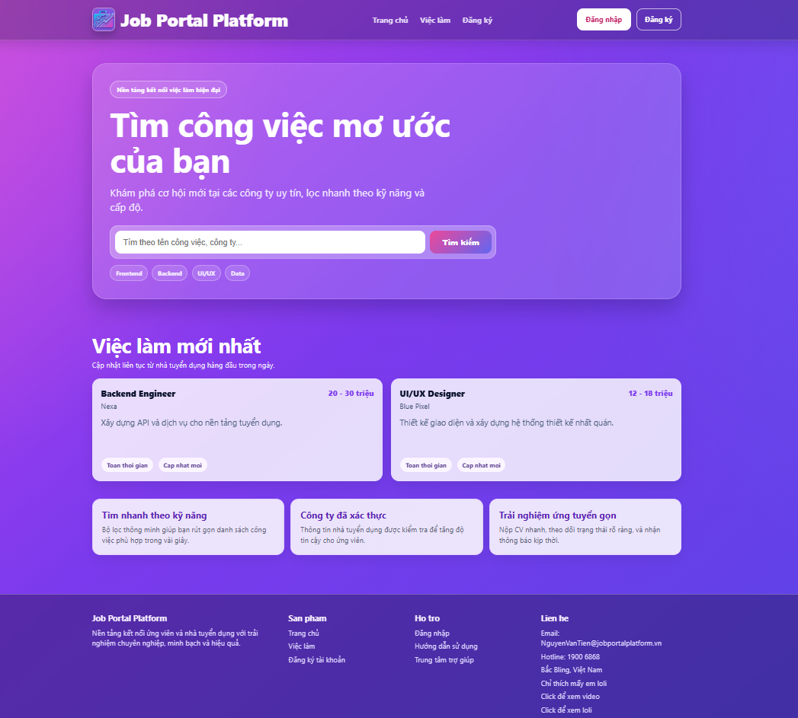
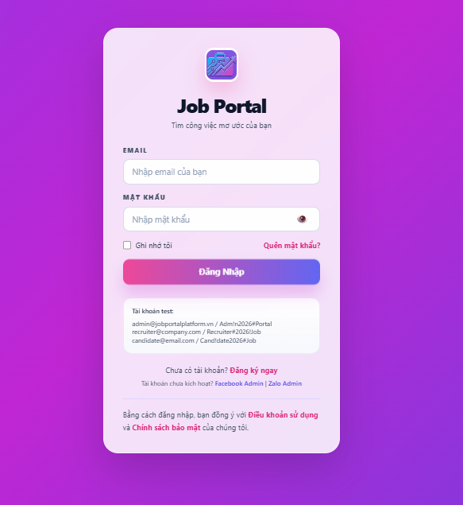
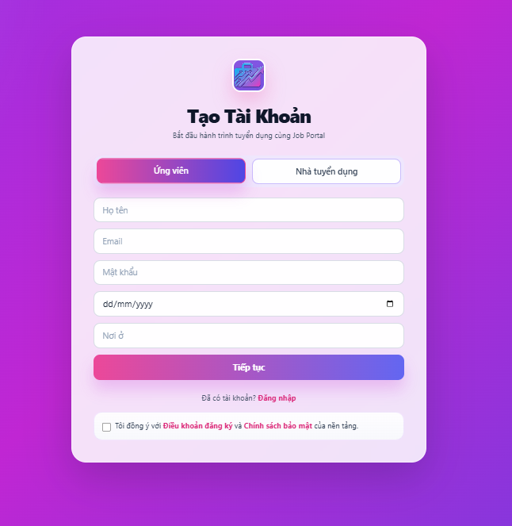
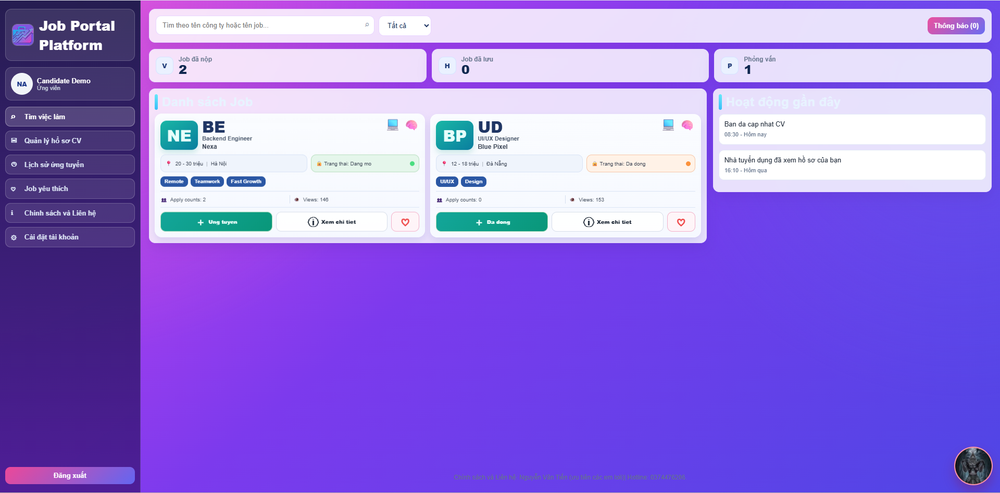
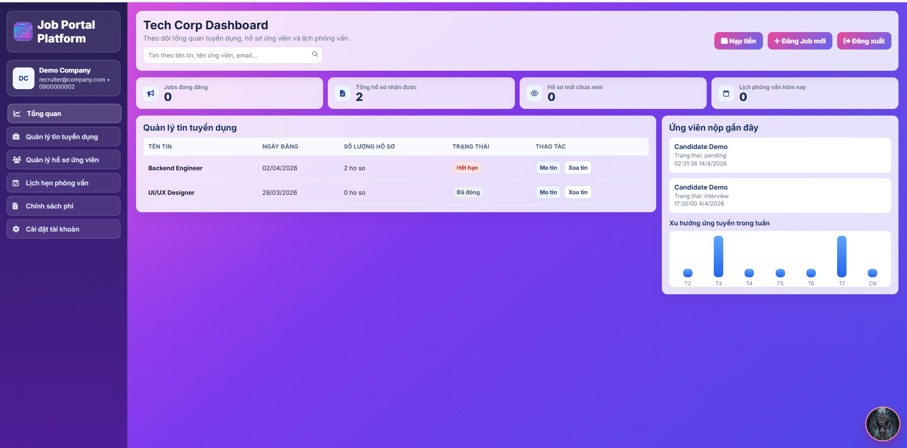
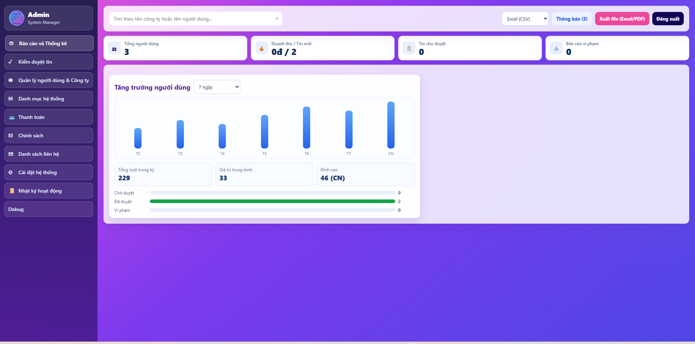

# Job Portal Platform

Job Portal Platform là một dự án tuyển dụng frontend-only được xây dựng bằng HTML, CSS và JavaScript thuần. Ứng dụng mô phỏng quy trình tuyển dụng nhiều vai trò trong trình duyệt, với dữ liệu được lưu bằng localStorage và sessionStorage để có thể chạy ngay mà không cần backend.

Tài liệu này là README tổng quan của dự án. Nó giúp người đọc nắm nhanh mục tiêu, công nghệ, cấu trúc, cách chạy, dữ liệu mẫu và luồng nghiệp vụ ở mức khái quát. Phần kiểm tra chi tiết theo từng bước được tách riêng trong [CHECKLIST.md](CHECKLIST.md) để hai file bổ trợ nhau: README mô tả bức tranh tổng thể, còn checklist mô tả cách kiểm thử cụ thể.

## Project Introduction

Job Portal Platform mô phỏng một hệ thống tuyển dụng cơ bản với ba nhóm người dùng chính:

- Ứng viên tìm kiếm việc làm, đăng ký, ứng tuyển và theo dõi hồ sơ.
- Nhà tuyển dụng đăng tin, quản lý hồ sơ ứng viên và theo dõi phỏng vấn.
- Quản trị viên giám sát dữ liệu hệ thống và xử lý các nội dung cần quản lý.

Dự án hiện đang ở trạng thái demo frontend nên toàn bộ dữ liệu đều được lưu trong trình duyệt, không phụ thuộc vào API thật.

## Objectives

Mục tiêu của dự án là:

- Mô phỏng luồng tuyển dụng thực tế trên giao diện web.
- Cung cấp trải nghiệm tách vai trò rõ ràng giữa ứng viên, nhà tuyển dụng và quản trị viên.
- Cho phép kiểm thử nhanh mà không cần cài đặt backend hoặc cơ sở dữ liệu ngoài.
- Làm nền cho việc phát triển tiếp thành hệ thống hoàn chỉnh trong tương lai.

## Technologies Used

- HTML5: xây dựng cấu trúc trang và các thành phần giao diện.
- CSS3: tạo layout, responsive, style hệ thống và hiệu ứng giao diện.
- JavaScript thuần: xử lý logic nghiệp vụ, phân quyền và thao tác dữ liệu.
- localStorage: lưu dữ liệu demo giữa các lần tải lại trang.
- sessionStorage: lưu trạng thái phiên làm việc hiện tại, chủ yếu là currentUser.
- Live Server / HTTP server cục bộ: chạy dự án trong môi trường web đúng chuẩn.

## Main Features

- Trang chủ hiển thị việc làm mới nhất và điểm vào các luồng xác thực.
- Đăng ký tài khoản cho ứng viên và nhà tuyển dụng.
- Đăng nhập, đăng xuất và điều hướng theo vai trò.
- Dashboard ứng viên với quản lý CV, job đã lưu, lịch sử ứng tuyển và thông báo.
- Dashboard nhà tuyển dụng với quản lý job, hồ sơ ứng viên, lịch hẹn phỏng vấn và chi phí mô phỏng.
- Dashboard quản trị viên với quản lý người dùng, công ty, tin đăng, ứng tuyển và cấu hình hệ thống.
- Trang debug để đối chiếu trạng thái dữ liệu trong trình duyệt.

## Folder Structure

```text
JobPortal-main/
├── assets/
│   └── images/
├── controllers/
│   ├── admin.js
│   ├── auth.js
│   ├── candidate.js
│   ├── cv.js
│   ├── job.js
│   └── recruiter.js
├── Data/
│   └── data-init.js
├── pages/
│   ├── admin.html
│   ├── candidate.html
│   ├── debug.html
│   ├── index.html
│   ├── login.html
│   ├── recruiter.html
│   └── register.html
├── CHECKLIST.md
└── README.md
```

## How to Run the Project

1. Mở thư mục `JobPortal-main` trong VS Code.
2. Chạy bằng Live Server hoặc một HTTP server tương đương.
3. Mở file `pages/index.html` để vào trang chủ.
4. Từ trang chủ, truy cập đăng nhập, đăng ký hoặc các dashboard theo vai trò.

Lưu ý: nên chạy qua server nội bộ thay vì mở file HTML trực tiếp để tránh lỗi đường dẫn và hạn chế vấn đề với localStorage/sessionStorage.

## Demo

Phần này dùng để hiển thị ảnh minh họa giao diện khi đưa README lên GitHub. Mỗi ảnh nên có một mô tả ngắn để người xem hiểu nhanh chức năng của màn hình.

### Homepage



Giao diện trang chủ hiển thị các tin tuyển dụng nổi bật và điểm vào các luồng đăng nhập, đăng ký.

### Login Page



Màn hình đăng nhập dành cho ứng viên, nhà tuyển dụng và quản trị viên.

### Register Page



Màn hình đăng ký hỗ trợ hai luồng tài khoản: ứng viên và nhà tuyển dụng.

### Candidate Dashboard



Dashboard ứng viên dùng để quản lý CV, job đã lưu, lịch sử ứng tuyển và thông báo.

### Recruiter Dashboard



Dashboard nhà tuyển dụng dùng để quản lý job, hồ sơ ứng viên và lịch hẹn phỏng vấn.

### Admin Dashboard



Dashboard quản trị viên dùng để giám sát dữ liệu hệ thống và xử lý các nội dung cần quản lý.

## Data Demo

### Tài khoản mẫu

- Admin: `admin@jobportalplatform.vn` / `Adm!n2026#Portal`
- Nhà tuyển dụng: `recruiter@company.com` / `Recruiter#2026!Job`
- Ứng viên: `candidate@email.com` / `Cand!date2026#Job`

### Dữ liệu được khởi tạo sẵn

Khi ứng dụng khởi động, `Data/data-init.js` sẽ nạp sẵn:

- Danh sách công việc mẫu.
- Danh sách người dùng demo cho 3 vai trò.
- Danh sách hồ sơ ứng tuyển mẫu.
- Danh sách ứng viên mẫu phục vụ màn hình debug.
- Tài khoản currentUser mô phỏng trạng thái đăng nhập ban đầu.

### Các khóa lưu trữ quan trọng

- `JOBS_DATA`: danh sách công việc.
- `APPLICATIONS_DATA`: danh sách ứng tuyển.
- `users`: danh sách người dùng.
- `jobPosts`: danh sách tin đăng.
- `applicants`: danh sách ứng viên.
- `savedJobs`: danh sách việc đã lưu.
- `candidateCVs`: danh sách CV.
- `allTransactions` / `ALL_TRANSACTIONS_DATA`: dữ liệu thanh toán mô phỏng.
- `currentUser`: người dùng hiện tại trong sessionStorage.

## Main Business Flows

### 1. Luồng ứng viên

1. Ứng viên truy cập trang chủ và tìm kiếm công việc phù hợp.
2. Ứng viên đăng ký hoặc đăng nhập vào hệ thống.
3. Ứng viên vào dashboard cá nhân để quản lý CV, job đã lưu, lịch sử ứng tuyển và thông báo.
4. Ứng viên mở chi tiết job, chọn CV phù hợp, nhập lời nhắn và gửi ứng tuyển.
5. Ứng viên theo dõi trạng thái hồ sơ, thông báo và lịch phỏng vấn.

### 2. Luồng nhà tuyển dụng

1. Nhà tuyển dụng đăng ký hoặc đăng nhập.
2. Nhà tuyển dụng vào dashboard recruiter.
3. Nhà tuyển dụng tạo tin tuyển dụng mới, nhập mô tả công việc, mức lương, địa điểm, yêu cầu và số lượng hồ sơ nhận tối đa.
4. Nhà tuyển dụng theo dõi danh sách ứng viên nộp hồ sơ, lọc theo trạng thái và thời gian.
5. Nhà tuyển dụng sắp lịch phỏng vấn, quản lý phí mô phỏng và theo dõi các liên hệ phát sinh.

### 3. Luồng quản trị viên

1. Quản trị viên đăng nhập vào hệ thống bằng tài khoản admin.
2. Quản trị viên truy cập dashboard admin để giám sát dữ liệu toàn hệ thống.
3. Quản trị viên kiểm tra tin tuyển dụng, hồ sơ ứng viên, công ty và các tài khoản người dùng.
4. Quản trị viên xử lý tin vi phạm, duyệt hoặc từ chối theo quy tắc hệ thống.
5. Quản trị viên quản lý liên hệ, thanh toán mô phỏng, danh mục hệ thống và các cấu hình chung.

### 4. Luồng dữ liệu

1. Khi mở ứng dụng, dữ liệu seed được nạp từ `Data/data-init.js`.
2. Người dùng thao tác trên giao diện.
3. Logic trong `controllers/` đọc và ghi dữ liệu từ trình duyệt.
4. Dashboard và trang debug phản ánh lại dữ liệu mới nhất.

## Future Improvements

- Tách dữ liệu sang API thật.
- Bổ sung cơ sở dữ liệu và lớp dịch vụ backend.
- Chuẩn hóa xác thực, phân quyền và bảo mật phiên làm việc.
- Bổ sung kiểm thử tự động cho các luồng quan trọng.
- Chuẩn hóa UI/UX theo một design system thống nhất.
- Bổ sung phân trang, bộ lọc nâng cao và tìm kiếm thông minh.

## Checklist Dự Án

> Phần dưới là checklist tổng hợp ở mức tài liệu. Danh sách kiểm thử chi tiết từng bước nằm trong [CHECKLIST.md](CHECKLIST.md).

### UI/UX Checklist

- [ ] Trang chủ có bố cục rõ ràng, dễ đọc và nhất quán.
- [ ] Màu sắc, khoảng cách và typography có tính chuyên nghiệp.
- [ ] Dashboard của ba vai trò có nhận diện riêng nhưng vẫn đồng bộ.
- [ ] Các nút, form, modal và bảng dữ liệu có trạng thái hiển thị hợp lý.
- [ ] Giao diện không bị vỡ khi co màn hình ở mức laptop hoặc tablet.
- [ ] Logo, icon và hình ảnh hiển thị đúng kích thước, không méo.
- [ ] Thông báo lỗi và thông báo thành công dễ nhìn, không gây nhiễu.

### Functional Checklist

- [ ] Trang chủ hiển thị đúng danh sách việc làm mẫu.
- [ ] Đăng ký ứng viên và nhà tuyển dụng hoạt động đúng.
- [ ] Đăng nhập và điều hướng theo vai trò hoạt động đúng.
- [ ] Đăng xuất xóa đúng trạng thái phiên hiện tại.
- [ ] Dashboard ứng viên hiển thị đúng CV, job đã lưu, lịch sử ứng tuyển và thông báo.
- [ ] Dashboard nhà tuyển dụng hiển thị đúng job, hồ sơ ứng viên và lịch phỏng vấn.
- [ ] Dashboard quản trị viên hiển thị đúng dữ liệu quản trị.
- [ ] Trang debug đối chiếu đúng trạng thái dữ liệu trong trình duyệt.

### Code Quality Checklist

- [ ] Cấu trúc thư mục dễ hiểu và đúng vai trò từng phần.
- [ ] Logic xác thực, dữ liệu và giao diện được tách tương đối rõ.
- [ ] Dữ liệu seed được tổ chức ở một nơi tập trung.
- [ ] Tên biến, tên hàm và luồng xử lý dễ đọc.
- [ ] Không có phụ thuộc ngoài cần thiết cho bản demo frontend.
- [ ] Các file JavaScript và HTML có thể bảo trì và mở rộng.

### Testing Checklist

- [ ] Kiểm tra tải trang trên Chrome hoặc Edge thành công.
- [ ] Kiểm tra đăng nhập sai và đúng.
- [ ] Kiểm tra đăng ký sai và đúng.
- [ ] Kiểm tra chuyển vai trò sau khi đăng nhập.
- [ ] Kiểm tra dữ liệu seed sau khi tải lại trang.
- [ ] Kiểm tra localStorage và sessionStorage trong quá trình thao tác.
- [ ] Kiểm tra responsive ở màn hình nhỏ hơn.
- [ ] Kiểm tra trang debug để đối chiếu trạng thái dữ liệu.

### Final Submission Checklist

- [ ] README đã mô tả rõ mục tiêu, công nghệ, tính năng và cách chạy.
- [ ] Demo ảnh minh họa đã được thay bằng screenshot thật nếu cần nộp.
- [ ] Checklist chi tiết trong [CHECKLIST.md](CHECKLIST.md) đã đầy đủ.
- [ ] Không còn lỗi nghiêm trọng ở luồng chính khi kiểm thử.
- [ ] Dữ liệu demo và tài khoản mẫu được ghi rõ ràng.
- [ ] Dự án sẵn sàng để bàn giao hoặc trình bày.